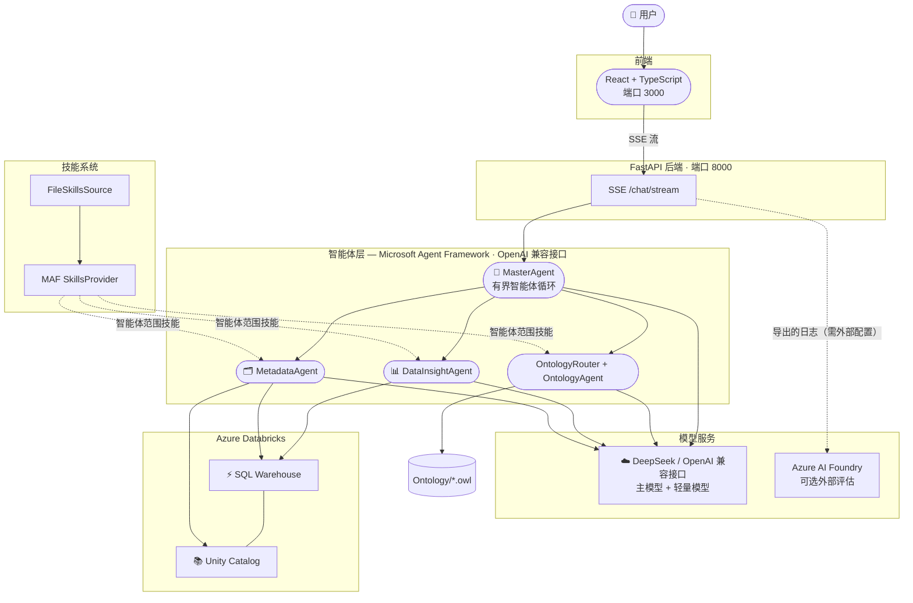

# Ontology Data Agent（本体数据智能体）

[English](README.md) | 简体中文

一个由 OpenAI 兼容大模型接口（默认 DeepSeek）、Microsoft Agent Framework (MAF)、OWL 业务本体，以及可配置的 Databricks/MySQL 数据源驱动的企业级智能数据分析系统。

## 🌟 功能特性

### 核心能力

- **多智能体架构**：MasterAgent 编排三个专用智能体 —— OntologyAgent、MetadataAgent 和 DataInsightAgent，各自拥有领域专属工具
- **MasterAgent 智能体循环**：一个有界的 MAF 函数循环，重复执行 模型 → 智能体/工具 → 观察，直到模型输出最终答案且不再发起工具调用
- **技能（Skill）系统**：原生 MAF `SkillsProvider` 按智能体范围播报技能，并按需加载完整指令或索引资源
- **数据洞察**：DataInsightAgent 对 Azure Databricks SQL Warehouse 执行只读的自然语言转 SQL 查询
- **元数据浏览与召回**：MetadataAgent 利用 Unity Catalog 表摘要进行确定性候选召回，批量获取候选详情，并保留 UC 工具用于模型驱动的缺口恢复
- **技能与本体引导的分析**：OntologyRouter 检查受治理的 Skills；普通启用请求使用确定性的、问题驱动的 OWL 证据、UC 物理验证，以及动态加载的规划 Skill，使主模型在运行时推导 SQL
- **会话级本体模式**：每个聊天会话独立启用或禁用本体增强；失败信息会显示在思考面板中，并回退到标准的元数据驱动工作流
- **用户编写的业务层**：业务用户在界面中编辑工作区语义文档（术语、指标定义、汇报规则）；它存储在 `data/` 下，注入到每个分析请求中，无需重启即可生效，并在两种本体模式下与 OWL 本体互补
- **多轮对话**：基于 MAF 内存线程存储的上下文感知对话；每个浏览器会话拥有独立线程
- **并发会话**：每个线程拥有独立的消息、加载状态、MAF 历史、取消操作，可与其他线程并行运行
- **停止与会话缓存**：停止操作仅取消当前活跃线程；完全相同的重复问题可以复用同一会话中已完成的答案，无需外部调用
- **流式 SSE 响应**：FastAPI 流式传输 `thinking`、`text`、`answer_reset`、`thinking_done`、`stopped`、`done` 和 `error`

### 技术栈

- **LLM 路由**：`OPENAI_MODEL` 用于 Master、本体路由/恢复和 DataInsight；`OPENAI_SMALL_MODEL` 用于元数据发现/验证，默认分别使用 DeepSeek V4 Pro 和 V4 Flash
- **智能体框架**：Microsoft Agent Framework 1.11 — `OpenAIChatCompletionClient`
- **主前端**：React + TypeScript（Vite，端口 3000）
- **后端 API**：FastAPI 与 Server-Sent Events（端口 8000）
- **数据分析**：Azure Databricks Unity Catalog 与 SQL Warehouse，通过 Databricks SQL 连接器访问
- **本体运行时**：Owlready2 只读递归 OWL 加载；可选的 HermiT 推理默认禁用
- **可观测性**：结构化活动流与滚动应用日志，适合外接评估流水线
- **智能体技能**：使用智能体技能扩展智能体能力，使智能体能够基于真实业务规则分析数据
- **统一数据平台**：将经过验证的物理元数据与现有 OWL 业务本体相结合，同时保持二者各自的权威边界

## 🏗️ 架构



## 📁 项目结构

```
Data-Insight-Agent-With-Ontology/
├── src/
│   ├── agents/
│   │   ├── master_agent.py      # 编排智能体；工具：delegate_metadata,
│   │   │                        #   delegate_data_analysis
│   │   ├── data_insight_agent.py# Databricks SQL；execute_sql + 有界
│   │   │                        #   上下文恢复；受治理 + 动态规划 Skills
│   │   ├── metadata_agent.py    # Unity Catalog 结构；工具：list_schemas,
│   │                            #   list_tables, get_table_details, search_tables；
│   │                            #   原生 Skill：metadata-mapping
│   │   ├── ontology_agent.py    # Owlready2 语义实体/属性/路径工具
│   │   └── maf_runtime.py       # MAF 1.11 客户端/会话/流适配器
│   ├── ontology/
│   │   └── service.py            # 只读 OWL 加载、索引与图查询
│   ├── metadata_catalog.py       # Unity Catalog SDK 访问、对象缓存、
│   │                            #   候选详情批量获取、SQL 标识符检查
│   ├── query_engine.py          # 请求级 MasterAgent 观察
│   │                            #   与流式上下文
│   ├── api/
│   │   └── main.py              # FastAPI 服务：SSE /chat/stream + REST 端点
│   ├── prompts/                 # 各智能体系统提示词：
│   │   └── master.py · ontology.py · data_insight.py · metadata.py
│   ├── config/
│   │   └── settings.py          # OpenAIConfig, AzureAIFoundryConfig,
│   │                            #   DatabricksConfig, OntologyConfig, AppConfig
│   ├── skills_provider.py       # 智能体范围的原生 MAF SkillsProvider 工厂
│   ├── business_layer.py        # 工作区业务语义文档存储（data/）
│   └── utils/
│       └── logger.py            # 日志工具
├── skills/
│   ├── analytics-spec/          # Skill：数据分析查询模式
│   │   ├── SKILL.md             # 意图路由 + 资源索引
│   │   └── references/
│   │       └── highest-spending-customer.sql
│   ├── sql-planning/   # Skill：动态 OWL + UC SQL 规划方法
│   │   └── SKILL.md
│   └── metadata-mapping/        # Skill：Unity Catalog 元数据约定
│       └── SKILL.md
├── Ontology/
│   └── aw_ontology.owl          # 只读业务本体及已定义类
├── frontend/                    # React + TypeScript (Vite)
│   ├── src/
│   │   ├── App.tsx              # 主聊天界面 + 活动面板
│   │   ├── services/api.ts      # 连接 FastAPI 后端的 SSE 客户端
│   │   ├── types.ts             # 聊天/会话/运行时 TypeScript 定义
│   │   └── types/activity.ts    # 活动流定义
│   ├── package.json
│   └── vite.config.ts
├── data/                        # 本地数据源（含 business_layer.md，已 git-ignore）
├── tmp/                         # 临时文件
├── logs/                        # 应用日志（application_YYYYMMDD.log）
├── run.sh                       # 启动脚本：全栈、后端、前端
├── stop.sh                      # 停止本地启动的后端/前端进程
├── requirements.txt             # Python 依赖
├── .env.example                 # 环境变量模板
└── README.md                    # 本文件
```

## 🚀 快速开始

### 前置条件

- Python 3.10 或更高版本
- Node.js 18.18+（用于 React 前端工具链）
- 仅当 `ONTOLOGY_ENABLE_REASONER=true` 时需要 Java 11+；显式 OWL 查询无需启动推理
- OpenAI 兼容接口的 API 密钥（默认提供方为 DeepSeek）
- 仅当日志导出到外部评估工作流时才需要 Azure AI Foundry 项目
- 一个分析数据源（可选，用于数据洞察）：
  - Azure Databricks 与 Unity Catalog SQL Warehouse（`DATA_SOURCE_TYPE=databricks`，默认）
  - MySQL 8.0+（`DATA_SOURCE_TYPE=mysql`）

### 安装

```bash
# 安装所有 Python 和 Node.js 依赖
./run.sh install
```

或手动安装：

```bash
python3 -m venv venv && source venv/bin/activate
pip install -r requirements.txt
cd frontend && npm install && cd ..
```

### 配置

```bash
cp .env.example .env
# 编辑 .env，填入模型与数据源凭据
```

最少必填变量（完整列表见 `.env.example`）：

```
OPENAI_BASE_URL=https://api.deepseek.com
OPENAI_API_KEY=<your-key>
OPENAI_MODEL=deepseek-v4-pro
OPENAI_SMALL_MODEL=deepseek-v4-flash
```

### 数据源选择

后端同一时刻只对接一个分析数据源，在启动时选定：

```
DATA_SOURCE_TYPE=databricks   # 默认；未设置或非法值时同样回退到 databricks
DATA_SOURCE_TYPE=mysql        # MySQL 8.0+
```

**MySQL 模式** — 追加：

```
MYSQL_HOST=localhost
MYSQL_PORT=3306
MYSQL_USER=readonly_user
MYSQL_PASSWORD=********
MYSQL_DATABASES=sales,reporting   # 白名单；首项为默认数据库
```

MySQL 模式下强制执行的规则：

- 表引用必须是两段式 `database.table`，且每个数据库都必须位于 `MYSQL_DATABASES` 白名单内；裸表名和三段式 `catalog.database.table` 会被拒绝。
- 查询只读：黑名单/sqlglot 校验层之外，连接池中的每条连接还会执行 `SET SESSION TRANSACTION READ ONLY` 纵深防御。
- SQL 以 MySQL 方言规划——不支持 `QUALIFY`。
- 通用策略变量（`DATA_MAX_ROWS`、`DATA_QUERY_TIMEOUT`、`DATA_METADATA_CACHE_TTL_SECONDS`）回退读取旧的 `DATABRICKS_*` 变量名，现有 `.env` 无需迁移。

推荐的 MySQL 只读账号授权：

```sql
CREATE USER 'readonly_user'@'%' IDENTIFIED BY '********';
GRANT SELECT ON sales.* TO 'readonly_user'@'%';
GRANT SELECT ON reporting.* TO 'readonly_user'@'%';
-- 以及元数据可见性：
GRANT SELECT ON information_schema.TABLES TO 'readonly_user'@'%';
GRANT SELECT ON information_schema.COLUMNS TO 'readonly_user'@'%';
```

MySQL 模式的限制：

- `analytics-spec` 受治理模板中硬编码三段式 `catalog.schema.table` 表名的条目会被作用域校验拦截；请编写两段式表名的 MySQL 专用规范，或依赖动态 `sql-planning`。
- 自带的 AdventureWorks OWL 本体携带 Databricks 映射候选；它们始终只是*候选断言*，必须经 MetadataAgent 验证，也可以用 `ONTOLOGY_DIR` 指向 MySQL 专属本体。

### 运行应用

```bash
./run.sh             # 全栈：FastAPI（端口 8000）+ React（端口 3000）
./run.sh backend     # 仅 FastAPI
./run.sh frontend    # 仅 React 开发服务器
./stop.sh            # 停止本地启动的后端/前端进程
```

如需让 FastAPI 后端脱离当前终端在后台持续运行，可使用：

```bash
mkdir -p logs
nohup ./run.sh backend > logs/backend.nohup.log 2>&1 &

# 确认服务已经启动
curl http://localhost:8000/health

# 查看后台日志
tail -f logs/backend.nohup.log

# 停止本项目启动的后台服务
./stop.sh
```

后台启动前仍需完成 `.env` 配置。端口可通过 `.env` 中的 `BACKEND_PORT` 调整；修改端口后，健康检查地址也应使用相同端口。

Windows PowerShell 可使用仓库中的 Windows 虚拟环境在后台启动后端：

```powershell
New-Item -ItemType Directory -Force logs, tmp | Out-Null
$backendProcess = Start-Process `
  -FilePath ".\venv\Scripts\python.exe" `
  -ArgumentList "-m", "uvicorn", "src.api.main:app", "--host", "0.0.0.0", "--port", "8000" `
  -RedirectStandardOutput "logs\backend.windows.log" `
  -RedirectStandardError "logs\backend.windows.error.log" `
  -WindowStyle Hidden `
  -PassThru
$backendProcess.Id | Set-Content "tmp\backend.windows.pid"

# 确认服务已经启动
Invoke-RestMethod http://localhost:8000/health

# 查看后台日志
Get-Content "logs\backend.windows.log" -Wait

# 停止后台服务
Stop-Process -Id (Get-Content "tmp\backend.windows.pid")
Remove-Item "tmp\backend.windows.pid"
```

上述 PowerShell 命令不启用 Uvicorn 自动重载，适合稳定的后台演示。开发时如需代码热重载，可在前台运行 `.\venv\Scripts\python.exe -m uvicorn src.api.main:app --host 0.0.0.0 --port 8000 --reload`。

在浏览器访问 React 界面：`http://localhost:3000`。

## 💡 使用说明

### 聊天界面（React）

1. **提问**：输入你的问题并按回车，或点击发送
2. **新会话**：点击"New Session"开启新的 MAF 会话
3. **流式响应**：答案逐 token 流式输出；"thinking"步骤显示在答案上方
4. **本体模式**：使用侧边栏开关，仅为当前会话启用本体增强
5. **业务层文档**：点击聊天头部的按钮编辑工作区语义文档（术语、指标定义、汇报规范）。它被所有会话共享，并从下一个问题开始生效——无需重启。建议只记录 OWL 本体*尚未*定义的内容，并注意已验证的 Databricks 结构始终优先。

### 问题类型

| 类型     | 示例                                              | 路由至         |
| -------- | ------------------------------------------------- | -------------- |
| 数据分析 | "按地区比较订单数、销量、销售额和平均客单价"      | 数据分析流水线 |
| 结构发现 | "What tables are available in the silver schema?" | MetadataAgent  |

### 功能开关

本体从 `.env` 初始化，之后由每个前端会话单独控制：

| 标志                        | 默认值   | 作用                           |
| --------------------------- | -------- | ------------------------------ |
| `DEFAULT_ENABLE_ONTOLOGY` | `true` | 每个新聊天会话的本体开关初始值 |

启用本体后，分析问题首先在主部署上进入 `OntologyRouter`。确认匹配受治理模板时跳过 Owlready2 和 MetadataAgent，随后 DataInsightAgent 加载指定的 Skill 和索引资源。否则代码直接调用问题驱动的 OWL 组合查询和已定义类查询；仅当结果较弱时才升级到完整的 OntologyAgent 工具循环。接着 Metadata 召回并批量获取 UC 候选，然后执行小模型验证轮次，最后 DataInsightAgent 加载 `sql-planning` 来选择分析角色、粒度、对比方式和 SQL。

本体禁用或不可用时，分析问题执行 `MetadataAgent（渐进加载 metadata-mapping）→ DataInsightAgent`。每个非受治理的 DataInsight 请求都会加载 `sql-planning`；在无本体情况下，它使用相同的方法，仅基于原始问题和已验证的元数据，不虚构语义证据。MasterAgent、OntologyRouter/OntologyAgent 和 DataInsightAgent 使用 `OPENAI_MODEL`；两种 Metadata 模式均使用 `OPENAI_SMALL_MODEL`。

## ⚙️ 配置参考

所有配置类位于 `src/config/settings.py`：

- `OpenAIConfig` — OpenAI 兼容接口地址、API 密钥、主模型与轻量模型
- `AzureAIFoundryConfig` — 用于部署特定集成的可选连接字符串占位符
- `DataSourceConfig` — 活跃数据源类型（`DATA_SOURCE_TYPE=databricks|mysql`，默认 `databricks`）
- `DatabricksConfig` — 工作区主机、令牌、SQL Warehouse HTTP 路径、Unity Catalog 白名单、查询限制、元数据缓存、召回索引/候选上限、小结构回退上限
- `MySQLConfig` — 主机、端口、用户、密码、字符集、`MYSQL_DATABASES` 白名单、SQLAlchemy 连接池尺寸/回收
- `DataSourcePolicyConfig` — 与数据源无关的 `DATA_MAX_ROWS` / `DATA_QUERY_TIMEOUT` / `DATA_METADATA_CACHE_TTL_SECONDS`（回退读取旧 `DATABRICKS_*` 变量名）
- `OntologyConfig` — OWL 目录/glob、仅本地加载、可选推理机、查询限制、模糊阈值、升级置信度、智能体超时
- `AppConfig` — 日志级别、MAF 函数循环预算、功能标志默认值、目录路径

## 📊 评估

应用当前未注册 Azure AI Foundry 或 Application Insights 导出器。将 `logs/` 中的日志导出到你的评估系统，可用于：

- 接地度（Groundedness）、相关性、连贯性指标
- A/B 测试：本体增强开启/关闭

## 🗺️ 产品待办事项

本待办清单仅记录规划中的工作；以下任何条目均不应视为已实现。GitHub Issues 是执行记录，本节保持为公开路线图摘要。

状态：`Planned`（已规划） · `Ready`（就绪） · `In progress`（进行中） · `Blocked`（受阻） · `Done`（完成）

| ID                                                                                    | 优先级 | 状态    | 待办项                                | 完成标准                                                                                                                                                                                                    | 依赖                                  |
| ------------------------------------------------------------------------------------- | ------ | ------- | ------------------------------------- | ----------------------------------------------------------------------------------------------------------------------------------------------------------------------------------------------------------- | ------------------------------------- |
| [`ODA-001`](https://github.com/tianputao/Data-Insight-Agent-With-Ontology/issues/1)  | P0     | Planned | **认证与租户隔离**              | 增加用户登录、后端令牌校验、对每个会话和运行的用户/租户所有权检查、受治理 SQL 的基于角色的访问，以及证明一个用户无法读取、停止或删除另一用户工作的授权测试。                                                | —                                    |
| [`ODA-002`](https://github.com/tianputao/Data-Insight-Agent-With-Ontology/issues/2)  | P0     | Planned | **持久会话与多 Worker 就绪**    | 将 MasterAgent 会话元数据、对话历史、响应缓存和活跃运行状态移出进程本地字典；支持多 Worker 或多 Pod 而不丢失路由、历史或停止请求。                                                                          | `ODA-001`                           |
| [`ODA-003`](https://github.com/tianputao/Data-Insight-Agent-With-Ontology/issues/3)  | P0     | Planned | **按问题运行追踪与 Trace 界面** | 为每个问题分配不可变的`run_id`；持久化其路由、本体模式、智能体阶段、工具调用、脱敏的输入/输出、SQL/查询 ID、耗时、结果状态和错误；增加专用界面页签用于检查每次运行。                                      | `ODA-001`、`ODA-002`              |
| [`ODA-004`](https://github.com/tianputao/Data-Insight-Agent-With-Ontology/issues/4)  | P0     | Planned | **端到端可观测性**              | 在 API、MasterAgent、子智能体、工具、已配置的大模型接口和 Databricks 之间添加 OpenTelemetry 兼容的追踪、指标和结构化日志；按`run_id`、`thread_id` 和用户/租户关联所有遥测数据，同时脱敏机密和敏感数据。 | `ODA-003`                           |
| [`ODA-005`](https://github.com/tianputao/Data-Insight-Agent-With-Ontology/issues/5)  | P0     | Planned | **代码强制的运行安全与取消**    | 在代码中强制每轮最多一次`delegate_data_analysis` 调用，使客户端断开连接设置取消事件，将取消传播到子任务和 Databricks 语句，并使可重试操作幂等。                                                           | `ODA-002`、`ODA-003`              |
| [`ODA-006`](https://github.com/tianputao/Data-Insight-Agent-With-Ontology/issues/6)  | P1     | Planned | **用户配置的受治理问题 + SQL**  | 提供经过认证的界面/API，供用户创建、测试、版本化、启用和停用问题到 SQL 的规则；校验只读、白名单内、完全限定的 SQL；记录所有权和审计历史；匹配的规则通过受治理契约路由，而非直接执行任意文本。               | `ODA-001`、`ODA-002`、`ODA-003` |
| [`ODA-007`](https://github.com/tianputao/Data-Insight-Agent-With-Ontology/issues/7)  | P1     | Planned | **为适合的答案生成图表**        | 当图表有用时，随表格结果一起返回类型化的可视化规范；在界面中渲染支持的图表类型并提供无障碍表格回退，保留单位/标签，不虚构 SQL 结果中不存在的维度或系列。                                                    | `ODA-003`                           |
| [`ODA-008`](https://github.com/tianputao/Data-Insight-Agent-With-Ontology/issues/8)  | P1     | Planned | **用户级持久记忆**              | 持久化用户批准的偏好、业务术语、常用分析设置和紧凑的对话摘要；按用户/租户隔离记忆，提供查看/编辑/删除控制，跟踪来源，且绝不将记忆视为已验证的 Unity Catalog 或本体证据。                                    | `ODA-001`、`ODA-002`              |
| [`ODA-009`](https://github.com/tianputao/Data-Insight-Agent-With-Ontology/issues/9)  | P1     | Planned | **可靠的多轮答案连续性**        | 通过在 MasterAgent 可见的历史中存储有界的结构化结果摘要，使后续问题能可靠地引用先前的 DataInsight 结果；保持缓存响应与 MAF 会话一致，而不是让它们的历史出现分歧。                                           | `ODA-002`、`ODA-003`              |
| [`ODA-010`](https://github.com/tianputao/Data-Insight-Agent-With-Ontology/issues/10) | P1     | Planned | **有界的智能体间证据契约**      | 对 Ontology→Metadata→DataInsight 的载荷模式进行版本化和校验，应用可配置的 token/字符预算，为保留的证据保留来源信息，并显式报告有损裁剪。                                                                  | `ODA-003`                           |
| [`ODA-011`](https://github.com/tianputao/Data-Insight-Agent-With-Ontology/issues/11) | P2     | Planned | **Databricks 并发执行**         | 用有界连接池或请求级连接替换进程级 SQL 连接和全局执行锁；在并发下保留查询取消、超时、重试和每用户限制。                                                                                                     | `ODA-001`、`ODA-004`              |
| [`ODA-012`](https://github.com/tianputao/Data-Insight-Agent-With-Ontology/issues/12) | P2     | Planned | **跨进程的持久运行恢复**        | 对已完成的流水线阶段设置检查点，使其他 Worker 可以安全地恢复中断的运行，而不重复已完成的本体/元数据工作或产生重复副作用；使用租约和幂等键防止双重恢复。                                                     | `ODA-002`、`ODA-003`、`ODA-005` |

### 待办事项守护原则

- OWL 仍是正式业务语义的权威；Unity Catalog 仍是物理表、列、类型和权限的权威。
- 用户配置的 SQL 必须通过与模型生成 SQL 相同的只读和目录/结构校验，并在需要时实施更严格的所有权和审批控制。
- 追踪、可观测性和记忆在持久化之前必须脱敏凭据、令牌、敏感行和未经批准的模型推理。
- 持久记忆是建议性上下文，而非自动的事实来源，用户必须能够审查和删除它。
- 图表规范必须从实际执行的结果数据派生，并且必须始终保留可读的表格回退。

## ✅ 验证

```bash
ONTOLOGY_ENABLE_REASONER=false venv/bin/python -m pytest test_script -q -p no:cacheprovider
npm --prefix frontend run lint
npm --prefix frontend run build
venv/bin/python -m pip check
npm --prefix frontend audit
```

## 📝 日志

日志位于 `logs/application_YYYYMMDD.log`：

- 智能体决策、工具调用、本体查询、SQL 执行、错误

## 📄 许可证

本项目按"原样"提供，供企业使用。

## 🤝 贡献

如有问题或贡献，请联系开发团队。

---

**用 ❤️ 构建，基于 Azure AI、Microsoft Agent Framework 和 Azure Databricks**
